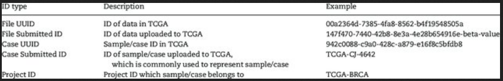

```{r setup, include=FALSE}
knitr::opts_chunk$set(echo = TRUE, 
                      message = FALSE, 
                      warning = FALSE, 
                      comment = NA)
```

## **Single Nucleotide Variants (SNVs)**

### **1. What are the differences between whole exome sequencing and whole genome sequencing for SNVs?**

Whole exome sequencing (WES) is defined by library enrichment for known exons in the genome. Thus, as we are filtering the set of the potential reads we would have to sequence in whole genome sequencting (WGS). This frees up space on the flowcell, and for the same cost scientists are now able to achieve larger sequencing depths, which improves statistical power of determining if an SNVs really exist. However, WGS allows the study of "non-coding regions" that could be of very large importance such as **promoter regions** and **enhancer regions** of which transcriptional factors can heavily influence the rate of transcription for various transcript isoforms.

As well as overall coverage difference of WES vs WGS, according to a pubmed article:

> <font size=2.5> For both SNVs and indels, the distributions of coverage depth, genotype quality, and minor read ratio were more uniform for WGS than for WES. </font>

reference: [Whole-genome sequencing is more powerful than whole-exome sequencing for detecting exome variants](https://pubmed.ncbi.nlm.nih.gov/25827230/)

### **2. Assuming that a region is sequenced using both methods, do they always detect the same mutations?**

As we saw in the previous reference publication, WES and WGS will not always detect the same mutations. Some reasons for this could be due to difference in coverage depth (as well as consistency of coverage) between the methods, though could also be due to difference in experimental nature of the methods (library enrichment for exonic regions in WES).

### **3. Import the attached vcf file**

**a).** What is the TGCA study ID for this sample?

On line 16 of the vcf file, we can find the line.

```{bash, eval=FALSE}
##INDIVIDUAL=<NAME=TCGA-2G-AAH5,ID=46199149-5cd7-4e6c-a217-4354d138e7bb>
```

According to: [A survey and evaluation of Web-based tools/databases for variant analysis of TCGA data](https://www.researchgate.net/publication/324225321_A_survey_and_evaluation_of_Web-based_toolsdatabases_for_variant_analysis_of_TCGA_data), we can read the ids in the following way.



With reference to this table of TCGA id formats, it seems that the **Case Submitted ID** for the sample is **TCGA-2G-AAH5** while either the **File UUID** for **Case UUID** is **46199149-5cd7-4e6c-a217-4354d138e7bb**

**b.)** What genome build was this sample aligned to?

On line 45 of the vcf file, we can find the line:

```{bash, eval=FALSE}
##reference=GRCh38.d1.vd1.fa
```

telling us that the human reference genome GRCh38 genome build was used for the alignment process.

### **4. Are all of the detected mutations "real"?**

There is support for the detected mutations, though they are not abosolutely certain. Uncertainty lies in many steps of the process of sequencing, alignment, and vcf calling, however all of the data that was collected supports the final decision of whether or not a mutation is present.

## **Structural Variants (SVs)**

### **1. What is the major difference on the impact on the genome between SVs and SNVs?**

Single nucleotide variants (SNVs) are very small mutations as they are definitionally only a modification of a single nucletoide, while structural variants (SVs) usually are the cause of more topologically impactful rearrangements effecting thousands to millions of base pairs.

### **2. What sequencing approach is suitable for SVs calling?**

As indicated by [Detection of structural DNA variation from next generation sequencing data: a review of informatic approaches](https://pubmed.ncbi.nlm.nih.gov/24405614/), we see that we can detect Structural variation from whole genome NGS data or "targeted" data including exomes or gene panels. However, bias may be introduced if using targeted sequencing.

More particularly, I believe that we should be using **paired end reads** to capture directionality and relationships between distant regions. That being said, the longer the read length the better as this can provide the best support that we have evidence of a particular rearrangement.

### **3. Can we detect all possible SVs?**

Most likely we cannot detect all possible SVs, (or even the composure of the SV) as many, many rearrangements in genomic structure are possible. As well, the further the variant genome mutates from our known reference genome, the harder it will be to generate the mutational map originating from our reference genome in order to make sense of the mutant genome.
